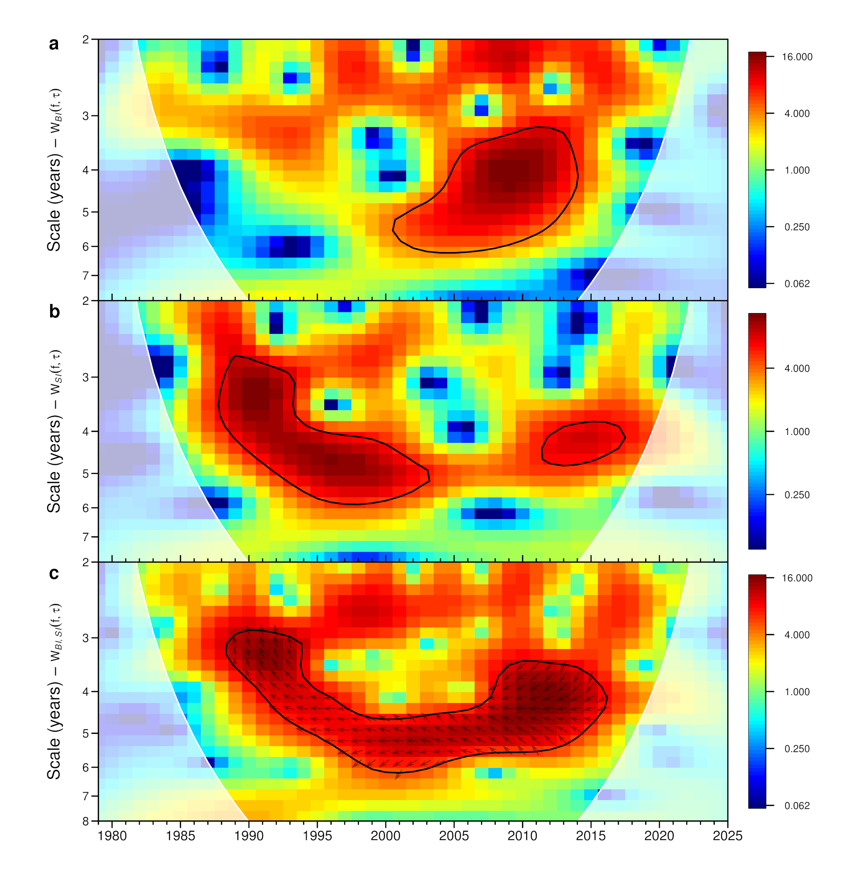

<style type="text/css">
  body{
  font-size: 12pt;
}
/* Headers */
h1,h2,h3,h4,h5,h6{
  font-size: 14pt;
}
</style>

<br>

**Keywords:** Antarctic fur seal, *Arctocephalus gazella*, abundance, assessment, decline, reduction, IUCN, Red List.

<br>

# Introduction

The Antarctic fur seal (*Arctocephalus gazella*) is one of the smallest otariids (eared seals), and has a circumpolar distribution around Subantarctic and Antarctic islands of the Southern Ocean where it aggregates to breed. It has a four-month lactation period, which is one of the shortest in its family, and it is highly sexually dimorphic, with a polyginous breeding system that significantly determines longevity and lifetime breeding success. Males mostly start holding mating territories between ages nine and then, and have brief reproductive lives subsequently. Starting at ages for to five on average, females normally produce a single pup almost every year, and can live up to 20 years or more. Due to its high fecundity and distribution in highly productive waters, it is the second most abundant pinniped in the Southern Hemisphere, and the most abundant otariid globally [@https://doi.org/10.1525/california/9780520248847.003.0027; @https://doi.org/10.1111/gcb.16947]. As a numerically important predator of Antarctic krill, it is an important component of Southern Ocean ecosystems, being a key indicator species of their state, function, and services.

According to @https://10.1534/g3.118.200171 and @https://doi.org/10.1038/s41598-020-61560-8, there are at least four distinct genetic groups or subpopulations, with the largest found in the South Atlantic sector of the Southern Ocean, including South Georgia, Bouvetøya, and the South Shetland Islands [@https://doi.org/10.1111/gcb.16947; @https://doi.org/10.1016/B978-0-12-804327-1.00046-7] (**Fig1**). Together, these three subpopulations comprise approximately 99% of the global abundance, but all have experienced rapid declines due to increasing external pressures [@https://doi.org/10.1007/978-3-030-63177-2_4; @https://doi.org/10.1111/gcb.16947; @https://doi.org/10.1038/nature13542; @https://10.3389/fmars.2021.796488; @https://doi.org/10.1111/mam.12327;@http://dx.doi.org/10.2305/IUCN.UK.2016-1.RLTS.T2058A66993062.en].

At Bird Island (NW South Georgia; **Fig.2b**), fur seal pup production estimates declined from 60,500 to 27,900 between 2009 to 2017, or 9.2% per year, and the mature female population declined annually by 7.2% [@https://doi.org/10.1111/gcb.16947]. At Bouvetøya (**Fig1**; 5), the second largest subpopulation with approximately 66,000 seals by 2002 [@https://doi.org/10.1007/s00300-005-0732-7], pup counts declined annually by 5.6%, between 2001 and 2007 [@http://dx.doi.org/10.2305/IUCN.UK.2016-1.RLTS.T2058A66993062.en]. And at the South Shetland Islands (**Fig1**, 4; **Fig2a**), with approximately 41,000 seals in 2002 [@https://10.3389/fmars.2021.796488], annual pup counts at study areas in the southwest declined by 90.9% between 2008 and 2023 [@https://doi.org/10.1111/mam.12327], or a 5.6% per year. At the entire archipelago, counts declined from 10,057 pups in 2002 to 7,602 in 2008 [@https://10.3389/fmars.2021.796488], equivalent to an annual decline of 4.6%.

Other breeding locations, currently part of a single genetic group named here the 'East Antarctica' subpopulation, are distributed in subantarctic islands of the southern Indian and southwestern Pacific Oceans (**Fig1**; locations 6-10). Recently, pup counts at most locations, including Marion Island (Prince Edward Islands) [@https://doi.org/10.1111/mms.12306], Possession Island (Crozet archipelago), Courbet Peninsula (Kerguelen archipelago) [@RN6225], Heard Island (Heard Island and McDonald Islands) [@https://doi.org/10.1007/s00300-003-0478-z], and Macquarie Island [@https://doi.org/10.1007/s00300-009-0645-y] (**Fig. 1**), have remained stable or slowly increasing annually, by approximately 1 to 4%.

The latest assessment of the species by the International Union for the Conservation of Nature (IUCN) [@http://dx.doi.org/10.2305/IUCN.UK.2016-1.RLTS.T2058A66993062.en], recognises that the global population is in decline, which is mostly driven by the rapid declines observed in the subpopulations of the South Atlantic region. However, the Red List category assigned is “least concern”, which is unlikely to reflect the real magnitude of recent population reductions. Here, I reanalyse the change of each subpopulation using the latest available data to provide an up to date reassessment for the species. I first reanalyse data from Bird Island, South Georgia, as main source of correction factors and adjustments, because comparable data from other regions are mostly lacking. The results include adjustments to scale up pup production counts to total mature population; and estimates of generation time (generation length, hereafter), required to evaluate population reduction. The analysis also evaluates and projects the overall population change at South Georgia with the most recently collected survey data at selected locations. I augment this with the most recent pup production data available from other breeding locations to evaluate global population change according to IUCN criteria [@https://www.iucnredlist.org/documents/RedListGuidelines.pdf]. Wherever the data shows long-term population declines, I evaluate population reduction and assign the most likely Red List criterion. Finally, I also analyse count data from Signy Island, representative of the mostly male temporary migration from South Georgia to the South Orkney Islands, to track by proxy nearly five decades of population change at South Georgia.  

# Materials and methods

## Study populations, distribution and abundance

South Georgia, in the Southwest Atlantic region of the Southern Ocean (**Fig1**), is by far the largest Antarctic fur seal subpopulation with an estimated 97-98% of the global pup production and 3.5 [3.1, 3.9] million seals in 2009 [@https://doi.org/10.1111/gcb.16947]. The subpopulation includes small numbers of breeders in the South Orkney and South Sandwich Islands archipelagos (**Fig.1**), also located in the Scotia Sea (**Fig.2a**), although the genetic identity of the South Sandwich seals has not been assessed. The South Orkney Island group (**Fig.2a**) has a population almost exclusively composed of non-resident juvenile and adult males in post-breeding temporary migration, largely from South Georgia [@https://doi.org/10.1139/f97-314; @https://nora.nerc.ac.uk/id/eprint/524417; @https://doi.org/10.1007/s00442-021-04983-y; @https://doi.org/10.1017/S003224740006397X], although there are small numbers of temporary migrants from the South Shetland Islands [@https://doi.org/10.1038/s41598-020-75148-9;@https://doi.org/10.1111/gcb.17191], given the relative proximity of both archipelagos. Males from South Georgia and South Shetland Islands typically migrate temporarily along the Weddell Sea and west Antarctic Peninsula, and as far South as the Bellingshausen Sea [@https://doi.org/10.1007/s00442-021-04983-y; @https://doi.org/10.1038/s41598-021-01700-w]. There are also incidental records of pups in the Antarctic Peninsula, e.g., near Palmer Station [@https://doi.org/10.1002/ece3.70833;@RN6230], but these are exceptional and extralimital within the species current breeding range.

The numbers of breeding females and pups at the South Orkney Islands are extremely low, and counted as less than 70 in the entire archipelago in the early 1970s. At Signy Island, which has been monitored annually since 1977 [@https://nora.nerc.ac.uk/id/eprint/524417], despite several annual counts of more than 20,000 individuals between 1994 to 2000, only a maximum of five pups were recorded in any year of the same period, and pup numbers have declined to near zero since 2000 [@https://doi.org/10.1007/s00300-009-0706-2]. Similarly, at Laurie Island, only four pups were observed from 1996 to 2005, despite a maximum of 16,610 individuals counted in early 2005 [@https://doi.org/10.3402/polar.v25i2.6243]. At the South Sandwich Islands, breeders and pups have rarely been counted due to difficult access to locations, but since the early 1960s [@https://doi.org/10.1017/S0032247400053742] and after the regional recovery from sealing, pup numbers increased to at least 1,750 by 1997/98, of which 500 were attributed to Zavodovski Island [@https://doi.org/10.1017/S0032247400026450], which was counted again in 2023/24 (**Table 1**). Published records with more recent data for other islands, including Visokoi which had a count of 900 in 1997/98 are lacking.

<br>

```{=html}
<style>
p.caption {
  font-size: 1.0em;
}
</style>
```

<center>

```{r Figure.1,fig.align="left",echo=FALSE, fig.cap="**Figure 1**: Distribution of breeding populations of Antarctic fur seals with detail on genetic subpopulations. The table shows estimated pup production up to 2010 or before, for remote locations not recently surveyed. Colours corresponds to identified genetic subpopulations",out.width = '100%',out.extra='style="background-color: #000000; padding:1px; display: inline-block;"'}
knitr::include_graphics("Figure1.png")
```

</center>

```{r Figure.2,fig.align="left",echo=FALSE, fig.cap="**Figure 2**: **a** Scotia Sea, with breeding locations of the putative genetic subpopulation of South Georgia, including South Sandwich and South Orkney Islands, and the subpopulation of the South Shetland Islands. **b**, Locations of South Geogia where population surveys were obtained in 2021-22. In locations 2-5, seal counts were obtained with high resolution images from Remotely Piloted Aerial Systems (**RPAS**)",out.width = '100%',out.extra='style="background-color: #000000; padding:1px; display: inline-block;"'}
knitr::include_graphics("Figure2.png")
```

</center>

<br>

## Data

### South Georgia

Antarctic fur seal demographic, genetic, and count data representative of South Georgia were collected at a long-term monitoring location of Bird Island named Special Study Beach (SSB) (54.0116$^\circ$S, 38.0507$^\circ$W; location 1, **Fig.2b**), from 1979 to 2025 [@https://doi.org/10.1017/S0032247400002680;@https://doi.org/10.1111/j.1469-7998.1984.tb05095.x;@https://doi.org/10.1111/j.1469-7998.1990.tb04032.x;@https://doi.org/10.1111/j.1365-2486.2008.01678.x; @https://doi.org/10.1111/gcb.16947]. Additional data were obtained from Maiviken (54.2435$^\circ$S, 36.5033$^\circ$W; location 4, **Fig. 2b**), where a set of colonies named Burnet1, Burnet2, Burnet2, Little, Poa1, Poa2, Poa3 and Tortula are counted annually during the breeding season. Maiviken is situated on South Georgia main land approximately 105 km to the east of Bird Island.

#### Bird island capture-recapture and productivity data

Capture-mark-recapture of individuals, monitoring of pup production, and collection of individual count data at Bird Island used in this analysis started in 1979 [@https://doi.org/10.1111/j.1469-7998.1984.tb05095.x] and have been consistently collected since 1984 onwards [@https://doi.org/10.1111/j.1469-7998.1990.tb04032.x; @https://doi.org/10.1111/j.1365-2486.2008.01678.x]. Annually at SSB, from November 1st to mid-January, daily numbers of new and total females, newborn pups and territorial males are consistently recorded during twice-daily surveys. Within a season, female breeding status and performance is monitored through tags, and territory tenure by males is monitored through individual temporary paint marks. For between-year recaptures, a variable sample of females has been captured since 1984 every season, reliably aged from sectioned post-canine teeth, marked with plastic tags on the fore flippers, and subcutaneous electronic chips (Passive Integrated Transponder tags, PIT-tags) fitted since 1997. Flipper tags have been given to each cohort of newborn pups since 1984 and PIT-tags implanted since 2001; and genetic samples from pups and breeding females are collected upon capture. For each territorial male, genetic tagging is obtained each season with a small biopsy remotely acquired using a low-power crossbow bolt with a modified sampling syringe. Females and males are highly philopatric and return ashore to breed almost every year [@https://doi.org/10.2307/1381999; @https://doi.org/10.1016/j.mambio.2011.09.002; @https://doi.org/10.1111/j.1365-294X.2006.03053.x], once established as breeders and territorials respectively. Early pup mortality is estimated from the recovery of dead pups, prior to flipper-tagging approximately 1.5 months after birth.

#### Count data

Count data were collected as close as possible to the peak pupping day. The pupping season, from mid-November to mid-January, peaks with high spatial synchrony between the 6th to 10th of December, when numbers of newborn pups, breeding females, and territorial males at each location reach their maximum daily values, and show lower day-to-day variability than at later dates [@https://doi.org/10.1111/j.1469-7998.1990.tb04032.x;@https://doi.org/10.1890/04-1153;
@https://doi.org/10.3957/0379-4369-37.1.1].

Apart from the daily counts at SSB during the breeding season, complete counts of the entire Bird Island were obtained in nine seasons, including visual counts in December 1988, 1989, 1990, 1994, and 1997, and photographic counts in December of 2003, 2008, 2016, and 2023. (Hereafter, a breeding season is referred to by the second year of the split-year austral summer; e.g., 2023-24 is 2024.). Counts were conducted from elevated vantage points in all the breeding beaches by trained biologists.

Comprehensive aerial photographic data of South Georgia mainland were obtained during two helicopter surveys of all the fur seal breeding beaches conducted in December 2006 and 2008. For this analysis I use the count data available at the repository @https://doi.org/10.1111/gcb.16947, and retain counts corresponding to locations 2 to 5 in **Fig.2b**. Surveys of these locations were repeated in December 2021 using RPAS (Remotely Piloted Aerial Systems). In these and other image-based surveys, two observers working independently using consistent training and methodology produced counts from digital images, classifying seals in four categories: pups, females, territorial males and non-territorial males.

From 2009 to 2025, colonies at Maiviken were visited every second day during the summer breeding season (November-February) to count numbers of fur seal males, females, pups and juveniles [@https://doi.org/10.5285/41bfd98c-1a36-4689-a578-ad584426f9d2]. The data record is from 2009 to date (2025), although counts from 2009 were sparse and likely to be inconsistent in methodology compared with subsequent records. Therefore, for this analysis I only retain the data for 2010 to 2025.

All together, and with a maximum straight-line distance between any two counting or monitoring locations of 125km, the data obtained for 2021/22 provide a representative sample of geographic population variation over space and time at South Georgia.

### South Orkney Islands

#### Count data

At Signy Island, South Orkney Islands (60.3385$^\circ$S, 45.0037$^\circ$W; **Fig.2**a), count data were collected around the entire island as part of a long-term monitoring programme which started in 1977 [@https://nora.nerc.ac.uk/id/eprint/524417], and continued to date with only a few interruptions due to weather or logistic constraints [@https://doi.org/10.1007/s00300-009-0706-2]. Counts by two trained observers using consistent methodology took place between mid-February and early March every year, when fur seals numbers peak.

### Pup count data for other subpopulations

Available pup production and abundance data up to 2004 for all the species range are summarised in @RN5984; although some of the data are known to be unreliable due to lack of counting efforts (e.g., South Georgia; see @https://doi.org/10.1111/gcb.16947), and use of biased adjustments. Many reported records are total pup counts at breeding locations, from which extrapolations to total population size are also produced. As discussed in the **Population-reduction** section below, extrapolations are based on inaccurate scaling factors, and do not separate mature population from pre-breeders, which is required by Red List assessments. Here, I only provide total pup production counts or estimates, summarised in **Table 1**, which are used in subsequent calculations together with the new mature population estimates for South Georgia.

+-------------------------+---------+-------------+--------+-------------+-------------------+
| Breeding location       | season  | count       | method | source      | Notes             |
+:========================+:========+:============+:=======+:============+:==================+
| Zavodovski Island, SSI  | 1997/98 | 500         | Visual | Dickens     | Late February; UC |
|                         +---------+-------------+--------+-------------+-------------------+
| South Sandwich Islands  | 2023/24 | 1265        | RPAS   | Ref. 1      | Peak pupping      |
+-------------------------+---------+-------------+--------+-------------+-------------------+
|                         | 1995/96 | 9530        | Visual | Ref. 2      | Late January; UC  |
|                         +---------+-------------+--------+-------------+-------------------+
| South Shetland Islands  | 2001/02 | 10057       | Visual | Ref. 3      | Late January; UC  |
|                         +---------+-------------+--------+-------------+-------------------+
|                         | 2007/08 | 7602        | Visual | Ref. 4      | Late December; UC |
|                         +---------+-------------+--------+-------------+-------------------+
|                         | 2024/25 | 901         | Visual | Ref. 5      | Late December; UC |
+-------------------------+---------+-------------+--------+-------------+-------------------+
| Nyrøysa, Bouvetøya      | 2001/02 | 15523 (543) | Visual | Ref. 6      | Early January     |
|                         +---------+-------------+--------+-------------+-------------------+
|                         | 2007/08 | 11000       | ?      | Ref. 7      | Extrapolation?    |
|                         +---------+-------------+--------+-------------+-------------------+
|                         | 2014/15 | 8080 (310)  | Visual | Lowther     | Early January     |
+-------------------------+---------+-------------+--------+-------------+-------------------+
| Marion Island           | 2000/01 | 464         | Visual | Ref. 8      | February; UC      |
|                         +---------+-------------+--------+-------------+-------------------+
|                         | 2003/04 | 744 (5)     | Visual | Ref. 8      | February; UC      |
|                         +---------+-------------+--------+-------------+-------------------+
|                         | 2006/07 | 1105 (9)    | Visual | Ref. 9      | January; UC       |  
|                         +---------+-------------+--------+-------------+-------------------+
|                         | 2009/10 | 1379 (27)   | Visual | Ref. 9      | January; UC       |   
|                         +---------+-------------+--------+-------------+-------------------+
|                         | 2012/13 | 1553 (64)   | Visual | Ref. 9      | January; UC       |  
|                         +---------+-------------+--------+-------------+-------------------+
|                         | 2015/16 | 2052 (107)  | Visual |de Bruyn     | January           |
|                         +---------+-------------+--------+-------------+-------------------+
|                         | 2018/19 | 2434 (169)  | Visual |de Bruyn     | January           |
|                         +---------+-------------+--------+-------------+-------------------+
|                         | 2021/22 | 2528 (134)  | Visual |Jordaan      | January           |
+-------------------------+---------+-------------+--------+-------------+-------------------+   
| Prince Edward Island    | 2000/01 | 404         | Visual | Ref. 9      | Late December; UC |
+-------------------------+---------+-------------+--------+-------------+-------------------+
| Crozet, Possession Is   | 2003/04 | 295         | Visual | Ref. 10     |                   |
|                         +---------+-------------+--------+-------------+-------------------+
|                         | 2020/21 | 504         | Visual | Ref. 11     |                   |
+-------------------------+---------+-------------+--------+-------------+-------------------+
| Kerguelen, Nuageuses Is.| 2000/01 | 3600        | Visual | Ref. 12     | December; UC      |
+-------------------------+---------+-------------+--------+-------------+-------------------+
| Kerguelen,              | 2000/01 | 1600        | Visual | Ref. 12     | December; UC      |
| Courbet Peninsula       +---------+-------------+--------+-------------+-------------------+
|                         | 2009/10 | 4287        | Visual | Ref. 11     | December; UC      |
|                         +---------+-------------+--------+-------------+-------------------+
|                         | 2020/21 | 6259        | Visual | Ref. 11     | December; UC      |
+-------------------------+---------+-------------+--------+-------------+-------------------+
| Heard Island            | 2000/01 | 1012        | Visual | Ref. 13     | November - March  |
|                         +---------+-------------+--------+-------------+-------------------+
|                         | 2003/04 | 1278        | Visual | Goldsworthy |                   |
+-------------------------+---------+-------------+--------+-------------+-------------------+
| McDonald Island         | 1979/80 | 100         | ?      | Ref. 10     |                   |
+-------------------------+---------+-------------+--------+-------------+-------------------+
| Macquarie Island        | 1999/00 | 152         | Visual | Ref. 10     | November - March  |
|                         +---------+-------------+--------+-------------+-------------------+
|                         | 2003/04 | 165         | Visual | Ref. 10     | November - March  |
|                         +---------+-------------+--------+-------------+-------------------+
|                         | 2011/12 | 189         | genetic| Goldsworthy | November - March  |
+-------------------------+---------+-------------+--------+-------------+-------------------+
**Table 1**. Antarctic fur seal pup counts and pup production obtaineed at breeding locations other than South Georgia and South Orkney Islands. Parentheses in **count** are estimated standard errors, normally obtained from mark-recapture estimates of pup production. **source** is either literature cited, or personal communications from various contributors, including those listed in next section. References cited are as listed here; Ref. 1: @https://doi.org/10.1017/S0032247400026450; Ref. 2: @RN6244; Ref. 3: @RN5389; Ref. 4: @https://doi.org/10.13140/RG.2.2.19451.64808; Ref. 5: @RN6246; Ref. 6: @https://doi.org/10.1007/s00300-005-0732-7; Ref. 7: @http://dx.doi.org/10.2305/IUCN.UK.2016-1.RLTS.T2058A66993062.en; Ref. 8: @https://journals.co.za/doi/abs/10.10520/EJC117228; Ref. 9: @https://doi.org/10.2989/18142320309504044; Ref. 10: @RN5984; Ref. 11: @RN6225; Ref. 12: @https://doi.org/10.3354/meps07305; Ref. 13: @https://doi.org/10.1007/s00300-003-0478-z. In **Notes**, UC stands for undercount.

## Analysis

### Population modelling

#### South Georgia

We obtained an up-to-date assessment for Bird Island and other locations at South Georgia with the latest available data and using population analysis methods of @https://doi.org/10.1111/gcb.16947. The analysis used integrated population models (IPMs) to evaluate population numbers, vital rates and other demographic parameters, and corrections for seal survey counts. It combined different data sources including individual recapture histories of fur seal pups and adults, pup production, and individual daily count data. To evaluate abundance change and trends at locations away from SSB, we assumed that the dynamics of their daily counts are highly correlated to those at SSB. This is accurate within Bird Island and with Maiviken (MVK), another study site located 105km East of Bird island as the crow flies [@https://doi.org/10.1111/gcb.16947], which is closer to the additional survey locations in 2022 (**Fig.2**b). However, we relaxed this assumption by also incorporating daily counts at Maiviken in the analysis. This accounted for differences in haul out patterns between this study location and SSB, and corrected counts at other locations based on their proximity to either study site.

##### Integrated population models (IPMs)

###### Females

We used the same models as described in @https://doi.org/10.1111/gcb.16947 with different formulations for females and males. For females, the expected number of individuals in year $t$+1 is described with the following age-stage-structured population projection model, which assumes a birth pulse and a pre-breeding census:

$E([N_{t+1}|N_{t}])=E\left( \begin{bmatrix} N_{1,t+1}|N_{1,t}\\N_{2,t+1}|N_{2,t}\\N_{3,t+1}|N_{3,t}\\N_{4,t+1}|N_{4,t}\\ \vdots\\  N_{7,t+1}|N_{7,t}\\ N_{7+,t+1}|N_{7+,t}\\N_{N,t+1}|N_{N,t}\\N_{B,t+1}|N_{B,t}\end{bmatrix}\right)=$

<br>
$\begin{bmatrix} 0 & 0 &\varsigma_{F}\phi^0\phi^1\phi^3\alpha^3 &\dots &\varsigma_{F}\phi^0\phi^1\phi^7\alpha^7 &0 &\varsigma_{F}\phi^0\phi^1\phi^N\psi^{NB} &\varsigma_{F}\phi^0\phi^1\phi^B\psi^{BB}\\ \phi^1 & 0 & 0 &\dots &0 &0 &0 &0 \\ 0 & \phi^2 & 0 &\dots &0 &0 &0 &0 \\ 0 & 0 & \phi^3(1-\alpha^3) &\dots &0 &0 &0 &0 \\ 0 & 0 & 0 &\ddots &0 &0 &0 &0 \\ 0 & 0 & 0 &\dots &\phi^7(1-\alpha^7) &0 &0 &0 \\ 0 & 0 &0 &\dots &0 &\phi^{7+} &0 &0 \\0 & 0 &0 &\dots &0 &0 &\phi^N\psi^{NN} &\phi^B\psi^{BN} \\ 0 & 0 &\phi^3\alpha^3 &\dots &\phi^7\alpha^7 &0 &\phi^N\psi^{NB}+\iota &\phi^B\psi^{BB}+\iota \end{bmatrix}_{t} \begin{bmatrix} N_{1,t}|N_{1,t-1}\\N_{2,t}|N_{2,t-1}\\N_{3,t}|N_{3,t-1}\\N_{4,t}|N_{4,t-1}\\ \vdots\\ N_{7,t}|N_{7,t-1}\\ N_{7+,t}|N_{P,t-1}\\ N_{N,t}|N_{N,t-1}\\N_{B,t}|N_{B,t-1}\end{bmatrix}$

<br>
where for year $t$,

* $N_{j,t}$ is the number of pre-breeders for ages $j$=1,…,7

* $N_{7+,t}$ is the number of pre-breeders aged 7 or above never observed breeding

* $N_{N,t}$ is the number of mature non-breeders

* $N_{B,t}$ is the number of mature breeders

* $\phi^0_t$ is pup survival from birth to tagging at 1.5 months of age

* $\phi^1_t$ is apparent survival from tagging to the end of the first census year

* $\phi^j_t$ is apparent survival of seals aged $j$=2,…,7 between $t$ and $t$+1

* $\phi^{7+}_t$ is apparent survival of pre-breeders never observed breeding between $t$ and $t$+1

* $\phi^N_t$ is apparent survival of mature non-breeders between $t$ and $t$+1

* $\phi^B_t$ is apparent survival of mature non-breeders between $t$ and $t$+1

* $\alpha^j_t$ is the probability that a pre-breeder of age $j$ starts breeding at that age between $t$ and $t$+1

* $\psi^{B-}_t$ is the probabilities of being $B$ in $t$ and $B$ or $N$ in $t$+1, conditional on surviving

* $\psi^{N-}_t$ is the probabilities of being $N$ in $t$ and $B$ or $N$ in $t$+1, conditional on surviving

* $\varsigma_{F}$ is the proportion of females at birth

* $\iota_t$ is the number of breeding immigrants at $t$+1 per mature female at $t$.

<br>
The IPM's likelihood is $\mathcal{L}(h,\phi,\alpha,\psi,p,y,n_{s}|N_{B},\iota)=\mathcal{L}_{MSCJS}(h|\phi,\alpha,\psi,p)\mathcal{L}_{sys}(N|\phi,\alpha,\psi,\iota)\mathcal{L}_{obs}(y|N_{B})\mathcal{L}_{c}(n_{s}|\beta,b,\lambda,\varphi,\zeta)$, and includes a multi-state Cormack-Jolly-Seber capture-mark-recapture model formulated as a Bayesian state-space model [@https://doi.org/10.1016/j.ecolmodel.2007.03.040;@https://doi.org/10.1016/B978-0-12-387020-9.00009-2] with a state process and an observation process, denoted together as $\mathcal{L}_{MSCJS}(h|\phi,\alpha,\psi,p)$. The model includes 12 states and represents survival and accession to breeding for pre-breeders ($P$) of ages 3 to 7, survival and transition of mature breeders ($B$) and for skippers or non-breeders ($N$), and two absorbing states, one for pre-bredeers older than 7 which are never seen breeding, and on for dead ($D$) or permanently emigrated females. The main data are the female encounter histories ($h$) as defined by categories specified in the observation process. The state process for marked individual $i$, age $j$, and year $t$ is

<br>
$z_{i,j,t+1} \sim \begin{pmatrix} 0 &\phi^1_{i,t} &0 &0 &0 &0 &0 &0 &0 &(1-\phi^1_{i,t}) \\ 0 &0 &\phi^2_{i,t} &0 &0 &0  &0 &0 &0  &(1-\phi^2_{i,t})\\ 0 &0 &0 &\phi^3_{i,t}(1-\alpha^3_{i,t}) &0 &0 &0 &\phi^3_{i,t}\alpha^3_{i,t} &0  &(1-\phi^3_{i,t})\\ 0 &0 &0 &0 &\ddots &0 &0 &\vdots &0 &\vdots \\ 0 &0 &0 &0 &0 &\phi^7_{i,t}(1-\alpha^7_{i,t}) &0 &\phi^7_{i,t}\alpha^7_{i,t} &0 &(1-\phi^7_{i,t}) \\ 0 &0 &0 &0 &0 &0 &\phi^7+_{i,t} &0 &0 &(1-\phi^{7+}_{i,t}) \\ 0 &0 &0 &0 &0 &0 &0 &\phi^B_{i,t}\psi^{BB}_{i,t} &\phi^B_{i,t}\psi^{BN}_{i,t} &(1-\phi^B_{i,t}) \\  0 &0 &0 &0 &0 &0 &0 &\phi^N_{i,t}\psi^{NB}_{i,t} &\phi^N_{i,t}\psi^{NN}_{i,t} &(1-\phi^N_{i,t}) \\ 0 &0 &0 &0 &0 &0 &0 &0 &0 &1 \end{pmatrix}$

<br>

where rows and columns are departure and arrival states between years $t$ and $t$+1, including an absorbing state, $P^{7+}$, for pre-breeders which are never observed breeding. The observation process $Y_{i,t}$ is conditional on the true individual states, $z_{i,t}$, in season $t$ and comprises five types of female observations:

* $P^0$ - observed as newborn, subsequently tagged and released as a pup

* $P^{a}; a=1,...,7+$ - observed as pre-breeder of ages 1 to 7 or above (7+)

* $B$ - observed as breeder

* $N$ - observed as non-breeder

and an unobserved category, $D$, which is dead or permanently emigrated. The observation process relates to the true states through the probabilities of detecting individuals observed as $s$ at time $t$, $p^s_t$, and is formulated as

$Y_{i,t+1}|Z_{i,t+1} \sim \begin{pmatrix} 0 &0 &0 &0 &1 \\ 0 &p^{P_1}_{t} &0 &0 &1-p^{P_1}_{t} \\ 0 &p^{P_1}_{t} &0 &0 &1-p^{P_1}_{t} \\ 0 &p^{P_1}_{t} &0 &0 &1-p^{P_1}_{t} \\ 0 &p^{P_2}_{t} &0 &0 &1-p^{P_2}_{t} \\ 0 &p^{P_2}_{t} &0 &0 &1-p^{P_2}_{t} \\ 0 &p^{P_2}_{t} &0 &0 &1-p^{P_2}_{t} \\ 0 &p^{P_2}_{t} &0 &0 &1-p^{P_2}_{t} \\ 0 &p^{P_2}_{t} &0 &0 &1-p^{P_2}_{t} \\ 0 &0 &p^{B}_{t} &0 &1-p^{B}_{t} \\ 0 &0 &0 &p^{N}_{t} &1-p^{N}_{t} \\ 0 &0 &0 &0 &1\end{pmatrix}$ 

<br>

where rows are states $P^a$, for $a=1,..., 7+$, $B$, $N$, and $D$, and columns are observation types in year $t$. Note that detection probabilities are combined for ages 1 to 3 ($p^{P_1}$), which are less likely to be encountered, and for ages 4 to 7+ ($p^{P_2}$), to avoid parameter identifiability problems due to lack of data when fitting the models.

<br>
The matrix population model, with a system process and an observation process, $\mathcal{L}_{sys}(N|\phi,\alpha,\psi,\iota)\mathcal{L}_{obs}(y|N_{BI})$, contributes to estimate population sizes and demographic rates, including immigration ($\iota$). Pup production data ($y|N_{B}$), which is observed with little error at SSB [@https://doi.org/10.1890/04-1153], is equivalent to the observed breeding female population, and defines the observation process. For model fitting, we selected Poisson distributions to introduce demographic stochasticity, as follows.

$N_{P_{1},t+1} \sim Poisson(\varsigma_{F}\phi^0_t\phi^1_tN_{BI,t})$

$N_{P_{2},t+1} \sim Poisson(\phi^2_tN_{2,t})$

$N_{P_{j},t+1} \sim Poisson(\phi^j_t(1-\alpha^j_t)N_{P_{j-1,t}}), \ {j=3,...,7+}$

$N_{R,t+1} \sim \sum_{j}Poisson(\phi^j_t\alpha^j_tN_{P_{j-1,t}}), \ {j=3,...,7}$

$N_{N,t+1} \sim \left[Poisson(N_{N,t}\phi^N_t\psi^{NN}_t)+Poisson(N_{BI,t}\phi^B_t\psi^{BN}_t)\right]$

$N_{B,t+1} \sim \left[Poisson(N_{N,t}\phi^N_t\psi^{NB}_t)+Poisson(N_{BI,t}\phi^B_t\psi^{BB}_t)+\sum_{j}Poisson(\phi_{j,t}\alpha^j_tN_{P_{j-1},t})\right]$

$N_{I,t+1} \sim Poisson\left[(N_{N,t}+N_{B,t})\iota_t\right]$

Note that the observed pup production ($y_t$) results from the number of breeders, which includes new recruits from SSB, breeders already at SSB, and breeding immigrants from elsewhere. The distinction between $N_B$ and $N_{BI}$ allows for estimates of the fecundity (or pregnancy) rate, $F_t$, which is the number of mature females ($N_B+N_N$) in year $t$ which survive and breed in year $t$+1, excluding recruits and immigrants in year $t$+1, divided by the number of mature females surviving to year $t$+1; and importantly, estimates of number of immigrants, $N_I$. This is achieved through the observation process as

$y \sim Poisson(N_{BI,t})$

$N_{BI,t} = N_{B,t}+N_{I,t}$

The last component of the likelihood, $\mathcal{L}_{c}(n_{s}|\beta,b,\lambda,\varphi,\zeta)$, evaluates the proportion of the estimated SSB population, $E([N_{t+1}|N_{t}])$, that represents a total daily female count at the SSB (denoted with superscript $S$). For this, daily counts obtained between November 1st and December 31st ($n^S_k$ for day $k$) are modelled with a generalised additive mixed model (GAMM) with a Poisson-log-normal structure [@https://doi.org/10.1017/CBO9780511790942], which takes into account overdispersion. The more general model also considered autocorrelation of first order in female counts:

$n_{k,t} \sim Poisson(\mu_{k,t})$

$log(\mu_{k,t}) = \beta_0+\sum_{l}b_l(d_k)\beta_l+\varphi\epsilon_{k,t-1}+\zeta_{k,t}$

$\zeta_{k,t} \sim N(0,\sigma^2_\varepsilon)$

where $d_k$ is the kth day of the survey season, $\beta$ are unknown parameters (penalties), $b$ is a vector of $l$ spline basis functions, $\varphi$ is an autocorrelation parameter with values between -1 and 1, $\epsilon_{k,t-1}$ is the residual associated with observation $k$ at day t-1, and $\zeta_{k,t}$ an overdispersion parameter. The likelihood is $\mathcal{L}_{c}(n_{s}|\beta,b,\lambda,\varphi,\zeta)$, where $\lambda$ are smoothing parameters.

<br>
The combined likelihood produces derived quantities $N^S_{M,t}⁄E(n^S_j)$ and $N^S_{B,t}⁄E(n^S_j)$, where $M=N+B$, $N$ are mature non-breeding and $B$ mature breeding females respectively; and $E(n^S_j)$ is the predicted female count at SSB on the $jth$ day. These multipliers of observed counts scale up estimates to total number of mature 

$\hat{N}_M=\sum_{c}n^c_j\hat{N}^S_M/E(n^S_j)$ 

and breeding females 

$\hat{N}_B=\sum_{c}n^c_j\hat{N}^S_B/E(n^S_j)$ 

at other locations, where $n^c_j$ is the female count at colony $c$ on day $j$. Note that the second quantity $(\hat{N}_B)$ is equivalent to pup production, and the first quantity is the parameter of interest for the Red List assessment.

These equations assume that the dynamics of daily counts at SSB and other locations are highly correlated, which is accurate within Bird Island and across other locations, as previously shown [@https://doi.org/10.1111/gcb.16947]. However, correlation between locations decays fast after the first six days following peak pupping, largely due to differences in haul out behaviour. This is shown in **Fig.3** for female counts during season 2022.

<br>

<center>

```{r Figure3,fig.align="left",echo=FALSE, fig.cap="**Figure 3**: Correlation of female counts at SSB and Maiviken (MVK; 105km E of SSB). Top left panel is the Pearson's correlation coefficient of predicted (from GAMM model) and observed counts at SSB during peak pupping, and at Maiviken from 0 to 20 days after peak, for 2014 to 2025.The top right panel shows in detail the maximum correlation of observed counts, with the regression of predicted counts at MVK on day 6 after peak against SSB at peak; counts at both locations were detrended to remove the observed decline at both locations. The bottom panels show the fit of Poisson GAM models with predictions rescaled to provide proportional predicted counts (with values between 0 and 1) for breeding females and territorial males during season 2022, when RPAS flights were conducted. Dots are observed counts, the black dashed vertical line is the estimated day of peak pupping, red and grey shaded areas correspond to negative and positive differences in counts between locations due to differences in seal haulout behaviour, and $\\delta$ coefficients are predicted differences between SSB and MVK on days when RPAS counts were obtained.",out.width = '100%',out.extra='style="background-color: #000000; padding:1px; display: inline-block;"'}
knitr::include_graphics("Figure3.png")
```

</center>

As seasonal count data were also available for Maiviken (MVK), we incorporated differences in haul out patterns between SSB and MVK to make observed counts at or near MVK scalable according to the ratios $N^S_{M,t}⁄E(n^S_j)$ or $N^S_{B,t}⁄E(n^S_j)$, which relate specifically to SSB counts. For this, we obtained predicted counts at both locations from Poisson GAMs fited to daily data, and predictions were rescaled to range between 0 and 1; $z_i=(n_i-min(n_i))/(max(n_i)-min(n_i))$. To obtain a corrected MVK count $n^{\\*M}_i$ on day $i$, we assume a difference in $E(n_i)$ between locations of size $\kappa_i$. At the transformed scale, $\kappa=(n^M_i\delta_i)/z^M_i$, where $\delta^-_i=z^M_i-z^S_i$, when $z^M_i>z^S_i$, and $\delta^+_i=z^S_i-z^M_i$, when $z^S_i>z^M_i$ (e.g., **Fig. 3**, lower panels). Thus, a rescaled MVK count with respect to SSB, is

$\begin{aligned}
 & n^{\\*M}_i=
 \begin{cases}
 n^M_i & \textrm{if } z^M_i=z^S_i\\
 \left(1-\frac{\delta^-_i}{z^M_i}\right)n^M_i & \textrm{if } z^M_i>z^S_i\\
 \left(1+\frac{\delta^+_i}{z^M_i}\right)n^M_i & \textrm{if } z^M_i<z^S_i\\
 \end{cases}
\end{aligned}$

This adds prediction uncertainty to counts away from SSB, more likely to follow a MVK haul out pattern, and for counts closer to SSB, some of the uncertainty can be reduced by obtaining and average corrected count at colony $c$, $\overline{n}^c_j$, weighted by the inverse of the distance in km to SSB or MVK. This is obtained as

$\overline{n}^c_j=\frac{(w_{1,j}n^c_j+w_{2,j}n^c_jK_j)}{\sum{w_j}}$,

where 

$K_j=1+\frac{\delta^+_i}{z^M_i}$ 

or 

$K_j=1-\frac{\delta^-_i}{z^M_i}$, 

and $w_{1,j}=1/d^{SSB}_j$ and $w_{2,j}=1/d^{MVK}_j$, with $d$ as distance in km to each location from counted colony $c$. Thus, a count closer to SSB will assume a more similar daily haul out pattern to this location, with $\overline{n}^c_j\rightarrow n^c_j$, whereas a count closer to MVK will have a stronger influence of $K_j$, with $\overline{n}^c_j\rightarrow n^c_jK_j$.

It follows that an estimate of total number of mature females at a survey area is
<br>
$\hat{N}_{F_M}=\frac{\hat{N}^S_M}{E(n^S_j)}\sum_{c}\frac{w_1n^c_j+w_2n^c_jK_j}{w_1+w_2}$,

and to account for pre-breeders and obtain an estimate of total number of females at a survey area we use
<br>
$\hat{N}_{F_{All}}=\left(1+\frac{\sum_{k}\hat{N}^S_{P_{k}}}{\hat{N}^S_M}\right)\frac{\hat{N}^S_M}{E(n^S_j)}\sum_{c}\frac{w_1n^c_j+w_2n^c_jK_j}{w_1+w_2}$,

where $\hat{N}^S_{P_{k}}$ is the estimated number of pre-breeders of age $k$, for $k=1,...,7+$, at SSB.

<br>

###### Males

The male IPM has a combined age-stage matrix model with pre-territorial males ($P$) of ages 1 to 11+ (ages 11 or older), and mature states including Territorial ($T$) and mature non-territorial ($N$). The lowest observed age at first territory tenure is 7, and first-time territorials older than 11 are seldom observed. The expected number of individuals in year $t$+1 is

$E([N_{t+1}|N_{t}])=E\left( \begin{bmatrix} N_{1,t+1}|N_{1,t}\\N_{2,t+1}|N_{2,t}\\ \vdots\\ N_{7,t+1}|N_{7,t}\\ \vdots\\  N_{11,t+1}|N_{11,t}\\ N_{N,t+1}|N_{N,t}\\N_{T,t+1}|N_{T,t}\end{bmatrix}\right)=$

<br>

$\begin{bmatrix} \varsigma_{M}\phi^0\phi^1 &0 &0 &0 &0 &0 &0 &0\\0 &\phi^2 &0 &0 &0 &0 &0 &0\\0 &0 &\ddots &0 &0 &0 &0 &0\\ 0 &0 &0 &\phi^7(1-\alpha^7) &0 &0 &0 &0\\ 0 &0 &0 &0 &\ddots &0 &0 &0\\0 &0 &0 &0 &0 &\phi^{11}(1-\alpha^{11}) &0 &0\\ 0 &0 &0 &0 &0 &0 &\phi^N\psi^{NN} &\phi^T\psi^{TN}\\0 &0 &0 &\phi^7\alpha^7 &\dots &\phi^{11}\alpha^{11} &\phi^N\psi^{NT} &\phi^T\psi^{TT}\end{bmatrix}_{t}\begin{bmatrix} N_{1,t}|N_{1,t-1}\\N_{2,t}|N_{2,t-1}\\\vdots\\ N_{7,t}|N_{7,t-1}\\ \vdots\\N_{11,t}|N_{11,t-1}\\ N_{N,t}|N_{N,t-1}\\N_{T,t}|N_{T,t-1}\end{bmatrix}$

<br>
where for year $t$,

* $N_{j,t}$ is the number of pre-territorial males for ages $j$=1,…,11

* $N_{N,t}$ is the number of territorial males skipping a breeding season

* $N_{T,t}$ is the number of territorial males

* $\phi^0_t$ is pup survival from birth to tagging at 1.5 months of age

* $\phi^1_t$ is apparent survival from tagging to the end of the first census year

* $\phi^j_t$ is apparent survival of seals aged $j$=2,…,11, between $t$ and $t$+1

* $\phi^N_t$ is apparent survival of territorial males skipping a breeding season between $t$ and $t$+1

* $\phi^T_t$ is apparent survival of territorial males between $t$ and $t$+1

* $\alpha^j_t$ is the probability that a male of age $j$ starts holding territory at that age between $t$ and $t$+1

* $\psi^{T-}_t$ is the probabilities of being $T$ in $t$ and $T$ or $N$ in $t$+1, conditional on surviving

* $\psi^{N-}_t$ is the probabilities of being $N$ in $t$ and $T$ or $N$ in $t$+1, conditional on surviving

* $\varsigma_{M}$ is the proportion of females at birth

* $\iota_t$ is the the proportion of immigrants among territorial males at $t$+1.

<br>
The male IPM's likelihood is $\mathcal{L}(h,\gamma,\phi,\alpha,\psi,p,y,n_{s}|N_{B},\iota)=\mathcal{L}_{MSCJS}(h|\phi,\alpha,p)\mathcal{L}_{MSJS}(h|\phi,\gamma,\psi,p)\mathcal{L}_{sys}(N|\phi,\alpha,\psi,\iota)\mathcal{L}_{obs}(y|N_{T})\mathcal{L}_{c}(n_{s}|\beta,b,\lambda,\varphi,\zeta)$. It is similar to the female IPM likelihood, but the capture-mark-recapture component is split into separate likelihoods given the different data types (PIT-tag vs genetic recaptures), sample size, and short temporal overlap of two data sets. Pups with implanted PIT-tags at birth represent largely pre-territorial component, and are used to model and accession to territories, $ϕ^j_{j,t}$ and $\alpha^j_t$, with likelihood $\mathcal{L}_{MSCJS}(h|\phi,\alpha,p)$; and territorial males captured and recaptured through genetic sampling contribute to estimate their survival ($ϕ^{T,N}_{t}$), territory tenure ($psi^{-T}_t$) and temporary emigration rates ($psi^{-N}_t$), with likelihood $\mathcal{L}_{MSJS}(h|\phi,\gamma,\psi,p)$.

In the MSCJS model the state process equation for marked pre-territorial individual $i$ of age $j$ in year $t$, is formulated as

<br>
$z_{i,t+1} \sim \begin{pmatrix} 0 &\phi^1_{i,t} &0 &0 &0 &0 &0 &0 &0 &(1-\phi^1_{i,t}) \\ 0 &0 &\phi^2_{i,t} &0 &0 &0 &0 &0 &0 &(1-\phi^2_{i,t})\\ 0 &0 &0 &\ddots &0 &0 &0 &0 &0 &\vdots\\0 &0 &0 &0 &\phi^7_{i,t}(1-\alpha^7_{i,t}) &0 &0 &0 &\phi^7_{i,t}\alpha^7_{i,t} &(1-\phi^7_{i,t}) \\ 0 &0 &0 &0 &0 &\ddots &0 &0 &\vdots &\vdots \\ 0 &0 &0 &0 &0 &0 &(1-\phi^{10}_{i,t}\alpha^{10}_{i,t}) &0 &\phi^{10}_{i,t}\alpha^{10}_{i,t} &(1-\phi^{10})\\ 0 &0 &0 &0 &0 &0 &0 &\phi^{11}_{i,t} &0 &(1-\phi^{11}_{i,t}) \\ 0 &0 &0 &0 &0 &0 &0 &0 &\phi^T_{i,t} &(1-\phi^T_{i,t}) \\ 0 &0 &0 &0 &0 &0 &0 &0 &0 &1 \end{pmatrix}$

<br>

where rows and columns are departure and arrival states between years $t$ and $t$+1, assuming that at age 11 all males  which survive are territorial. The observation process $Y_{i,t}$ conditional on true individual states ($z_{i,t}$) comprises three types of observations:

* $P^0$ - observed as newborn, subsequently tagged and released as a pup

* $P^{a}; a=1,...,7+$ - observed as pre-territorial of ages 1 to 11

* $T$ - observed as territorial.

and an unobserved category, $D$, which is dead or permanently emigrated. The observation process includes the probabilities of detecting individuals observed as $s$ at time $t$, $p^s_t$, and is formulated as

$Y_{i,t+1}|Z_{i,t+1} \sim \begin{pmatrix} 0 &0 &0 &1\\ 0 &p^{P_1}_{t} &0 &1-p^{P_1}_{t}\\ 0 &\vdots &0 &\vdots\\0 &p^{P_{11}}_{t} &0 &1-p^{P_{11}}_{t}\\ 0 &0 &p^{T}_{t} &1-p^{T}_{t}\\0 &0 &0 &1\end{pmatrix}$ 

<br>

where rows are states $P^0$ (pup), $P^a$, for $a=1,..., 11$, $T$, and $D$, and columns are observation types in year $t$.

As the elapsed time between birth and accession to territory can be 10 years or more, observations of pre-territorials becoming territorials over 25 years of study were only a small fraction of the total number of PIT-tagged male pups. This limited parameter estimability, statistical power and model selection, making IPM fitting inefficient. As a valid alternative [@https://doi.org/10.1111/j.0006-341X.2002.00540.x], I used informative priors for $ϕ^j_t$ and $\alpha^j_t$ in the IPMs, obtained from a simplified MSCJS recruitment model [@https://doi.org/10.1080/00063659909477234] fitted independently to the PIT-tag data set. For this, I combined detection probabilities for pre-territorial of ages 1 to 11 ($p^{P_j}=p; j=1,...,11$), which are mostly unobservable, and set $\alpha^j, j=7,...,11$, constant for the $j$th age.

The MSJS likelihood, $\mathcal{L}_{MSJS}(h|\phi,\gamma,\psi,p)$, is based on a multi-state Jolly-Seber model with hierarchical state-space formulation and parameter-expanded data augmentation [@https://doi.org/10.1016/B978-0-12-374097-7.00012-0; @https://doi.org/10.1016/B978-0-12-387020-9.00010-9]. The model considers only territorial males. The total number of individuals alive during the study is $N^s$, and $b_t$ is the probability that a new territorial male enters the population in year $t$, so that the number of new territorial males in a year is $B_t=N^sb_t$. For data augmentation [@https://doi.org/10.1016/B978-0-12-387020-9.00010-9], we consider $M$ individuals, of which $N^s$ is a subset, and $b_t$ is derived as a restricted dynamic occupancy model [@https://doi.org/10.1198/106186007X181425]. This relies on $\gamma_t$, which is the probability that a male from $M$ holds territory for the first time in year $t$, so that

$E(B_t)=\prod_{i=1}^{t-1}(1-\gamma_i)\gamma_t$, 

and 

$N^s=\sum_{t}B$. 

The state process equation for male $i$ and year $t$, and state $r$ is formulated as

$z_{i,t+1} \sim \begin{pmatrix} 1-\gamma_t &\gamma_t &0 &0\\ 0 &\phi^T_{i,t}\psi^{TT}_{i,t} &\phi^T_{i,t}\psi^{TN}_{i,t} &1-\phi^T_{i,t}\\ 0 &\phi^N_{i,t}\psi^{NT}_{i,t} &\phi^N_{i,t}\psi^{NN}_{i,t} &1-\phi^{N}_{i,t}\\ 0 &0 &0 &1\end{pmatrix}$

where the states in rows and columns are $P$ (not yet territorial in the population), $T$, $N$, and $D$ (Dead or permanently emigrated), between years $t$ and $t$+1. The observation process is

<br>
$Y_{i,t+1}|Z_{i,t+1} \sim \begin{pmatrix} 0 &1\\ p^T_t &1-p^T_t\\ 0 &1\\ 0 &1\end{pmatrix}$

where $p^T_t$ is the recapture probability of territorial males and non-territorial males are unobserved, as in a temporary emigration model [@https://doi.org/10.1890/03-3110].

The number of new territorial males each year ($B_t$) confounds males born at SSB starting to hold territory with immigrants that never held a territory at SSB before, and the two components are separated with the demographic part of the IPM (below), which combines both male capture-recapture data sets.

The matrix population model, $\mathcal{L}_{sys}(N|\phi,\alpha,\psi,\iota)\mathcal{L}_{obs}(y|N_{T})$, with data on male pup production, $\varsigma_{M}N_{0,t}$, which defines the observation process, contributes to estimate population sizes and demographic rates, including immigration ($\iota$). For model fitting, we select Poisson distributions which introduce demographic stochasticity. For the pre-territorial component, the equations are

$N_{P_{1,t+1}} \sim Poisson(\varsigma_{M}\phi^0_t\phi^1_tN_{0,t})$

$N_{P_{j,t+1}} \sim Poisson(\phi^j_t N_{P_{j,t+1}}) , \ {j=2,...,6}$

$N_{P_{k,t+1}} \sim Poisson(\phi^k_t(1-\alpha^k_t)N_{P_{k-1,t}}) , \ {k=7,...,11}$

For the territorial data set, the MSJS model directly produces estimates of $N_{N,t+1}$, $N_{T,t+1}$, and $B_t$, which allows for an estimate of immigrants as

$N_{I,t+1} \sim B_t - \sum_{j}Poisson(\phi^j_t\alpha^j_tN_{p_{j-1,t}})$

The fraction of the estimated representative study population, $E\left([N_{t+1}|N_t]\right)$, that is a territorial male count ($n^S_j$) obtained between November 1st and December 31st, is modelled with a Poisson GAMM, exactly as in the female IPM. It is the last component of the male IPM likelihood, $\mathcal{L}_{c}(n_{s}|\beta,b,\lambda,\varphi,\zeta)$ and results in derived quantities $N^S_{M,t}⁄E(n^S_j)$ and $N^S_{T,t}⁄E(n^S_j)$, where $M$ and $T$ are mature ($T+N$) and territorial ($T$) males respectively; and $E(n^S_j)$ which is the predicted male count at SSB on the $j$th day. 

These are Used as multipliers of observed counts at other locations to obtain estimates of total number of mature males

$\hat{N}_M=\sum_{c}n^c_j\hat{N}^S_M/E(n^S_j)$

and territorial males 

$\hat{N}_T=\sum_{c}n^c_j\hat{N}^S_T/E(n^S_j)$, 

where $n^c_j$ is the male count at colony $c$ on day $j$. 

The estimate of mature males at a study area adjusting for differences in haul out between SSB and MVK is

$\hat{N}_{M_M}=\frac{\hat{N}^S_M}{E(n^S_j)}\sum_{c}\frac{w_1n^c_j+w_2n^c_jK_j}{w_1+w_2}$,

and an absolute estimate of total number of males at a study area is obtained adjusting for pre-territorial males,

$\hat{N}_{M_{All}}=\left(1+\frac{\sum_{k}\hat{N}^S_{P_{k}}}{\hat{N}^S_M}\right)\hat{N}_{M_M}$,

where $\hat{N}^S_{P_{k}}$ is the estimated number of pre-territorials of age $k$, for $k=1,...,11$, at SSB. (See female section for the derivation of $\overline{n}^c_j$.

##### IPMs implementation, assessment, and selection

I closely follow methods of @https://doi.org/10.1111/gcb.16947 and make the assumption of independence between data sets. As in many IPMs, this is not met when for example, I use the encounter histories $h$ of individuals which are also counted. However, based on recent experimental evidence [@https://doi.org/10.1890/08-2235.1;@https://doi.org/10.1111/ele.12578;@https://doi.org/10.1002/eap.2258], this is unlikely to be a source of bias and affect model estimation and performance, provided that model assumptions are met [see @https://doi.org/10.1111/2041-210X.13195]. These assumptions have already been evaluated for earlier versions of the the same data sets in model components of our IPMs which have been used independently elsewhere [@https://doi.org/10.1111/j.1365-2486.2008.01678.x;@https://doi.org/10.1038/nature13542]. For example, the effects of tag-loss on survival. However, when fitting the models, I used predictive checks to assessed the ability of the models to generate data that were consistent with the observed data [@https://doi.org/10.1111/1467-9876.00190] (data not presented), and in particular in relation to variation between estimates of survival and emigration derived from the IPM.

I use Markov Chain Monte Carlo (MCMC) methods in BUGS language and program JAGS [@https://www.r-project.org/conferences/DSC-2003/Proceedings/Plummer.pdf], run from $\texttt{R}$ [v4.5.0 @R-base] using packages $\texttt{jagsUI}$ [@jagsUI] and $\texttt{rjags}$ [@rjags] to fit the IPMs. To specify priors, I use Normal distributions with numbers of pre-breeders, breeders and mature non-breeders observed in the first year for the initial population sizes. For the capture-recapture part, model fit was initially assessed with frequentist multistate goodness-of-fit testing [@https://doi.org/10.1111/1541-0420.00006] using $\texttt{R2ucare}$ [@https://doi.org/10.1111/2041-210X.13014]. Selection of best models was subsequently based on WAIC [@https://doi.org/10.1007/s11222-013-9416-2;@http://jmlr.org/papers/v11/watanabe10a.html], and the IPMs were fitted with the best mark-recapture modelling options.

I selected temporal variation in parameters as much as possible to reflect the population state at the time of data collection and obtain accurate abundance estimates; but it was not always possible when data were sparse as in the male mark-recapture. For the female IPM, I used independent temporal random effects for $\phi_j$ and $\alpha_j$ for ages 1 to 7 and 3 to 7 respectively, $\psi^{NB}$, $log(\iota)$, $p^{P1}$, $p^{P2}$, $p^B$ and $p^N$ (e.g. $logit(\psi^{NB}_{i,t})=\mu^{^NB}_i+\varepsilon^{NB}_{i,t}$ , where $\varepsilon^{NB} \sim Normal(0,\sigma^2_{NB})$, with diffuse Uniform priors for $\sigma^2_*$. I used correlated temporal random effects for $\phi_B$, $\phi_N$ and, $\psi_{BN}$, where $\varepsilon^{\theta}_{i,t} \sim MVNormal(0,\Sigma_{\theta,t})$ and $\Sigma_{\theta,t}$ is a temporal variance-covariance matrix describing the temporal variance of each parameter ($\theta$) and the temporal covariance among parameters [@https://doi.org/10.1111/j.0006-341X.2005.030906.x]. For $\Sigma_{\theta,t}$ I used priors from an inverse Wishart distribution [@https://doi.org/10.1017/CBO9780511790942] with scale matrix $\Omega$ as identity matrix and for degrees of freedom. For the genetic mark-recapture part of the male IPM, I chose the best combination of $\gamma$, $\phi$, and  $\psi$, either with temporal random effects, correlated temporal random effects, or constant values over time based on the lowest WAIC of a fitted set of models with different parameter combinations (data not presented). For juveniles and pre-territorials, $\phi_j$ and $\alpha_j$ were selected as informative Beta priors with shape parameters obtained from an independent best fit of a multistate mark-recapture model of the PIT-tag data set. The priors incorporated temporal variation as observed in the data record, reflecting uncertainty due to environmental stochasticity at the time of the survey counts.

The GAMMs of daily counts in the IPMs were implemented using methods of @https://doi.org/10.18637/jss.v075.i07. Thus, I used multivariate Normal priors on the smooth coefficients in the JAGS models, and the smoothing parameters and smoothing penalty matrices directly specified the prior multivariate normal precision matrix as input data. I implemented preliminary model selection based on WAIC to test for overdispersion and autocorrelation in daily counts before incorporating the best Poisson models in the IPMs.

In all IPM analyses, I used 200,000 iterations of three Markov chains and discarded the first 50,000 samples of each chain as burn-in phase, thinning the remainder to every 10th sample. We assessed chain convergence visually using trace plots, through the mixing of the chains and sample autocorrelation plots, and using the $\hat{R}$ potential scale reduction factor statistic of less than 1.05 to retain posterior distribution samples [@https://doi.org/10.1201/b10905-7;@https://doi.org/10.1214/20-BA1221].

#### South Orkney Islands

##### Population dynamics

I evaluated population trends at Signy Island using a log-linear model with a discrete-time stochastic Gompertz formulation [@https://doi.org/10.2307/2937041; @https://doi.org/10.1002/jwmg.425] of the observed fur seal count $y_t$ for year $t$, in response to a year-lagged count, $y_{t-1}$, with coefficient $ν$. To accommodate positive skewness from numerous low counts, I used a negative binomial error distribution [e.g., @https://doi.org/10.1093/biomet/asp029], with $y_t \sim NB(r,p_t)$, where $r$ and $p_t$ were the dispersion and success rate parameters respectively, so that $p_t=r/(r+E[y_t])$. 

Expressed in natural log scale, $x_t=log E[y_t]$, the Gompertz Negative Binomial Model (*GNBM*) was formulated as

$log (\frac{x_t}{x_{t-1}})=\upsilon+(1+\nu)y^T_{t-1}+\varepsilon$

where intercept $\upsilon$ measures intrinsic growth rate, equivalent to $log(\lambda)$ when $E[y]=1$, $\nu$ is a density-dependence coefficient, and $\varepsilon$ and error term.

##### Synchrony between South Orkneys and South Georgia

To formally test for synchrony between locations, I use a mixed-effects formulation (*GNBMM*) with two independent random effects  [@RN5896; @RN6177; @RN5892]. A time-specific random effect $\delta_t \sim N(0,\sigma^2_{\delta})$ which models common synchronous variation across sites; and a separate time-specific random effect for each site $s$, $\epsilon_{t,s} \sim N(0,\sigma^2_\epsilon)$ which accounts for additional and asynchronous variation. The effects are incorporated as

$log (\frac{x_{s,t}}{x_{s,t-1}})=\upsilon_s+(1+\nu_{s,0})y^T_{s,t-1}+\delta_t+\epsilon_{t,s}$,

Here, $\sigma^2_\delta+\sigma^2_{\epsilon_s}$ is between-year variance unexplained by density-dependence. The variances are equally partitioned between sites in the shared term ($\sigma^2_\delta$), but not between unshared components ($\sigma^2_{\epsilon_s}$). The fraction of between-year variance accounted by the shared component is the intra-class correlation, $ICC_s=\sigma^2_\delta/(\sigma^2_{\delta}+\sigma^2_{\epsilon_s})$, which measures the synchrony of SI with BI,and BI with SI. When the shared (synchrony) component is large relative to the unshared component, $ICC_s$ approaches 1, and tends to zero otherwise.

##### Connection between Signy Island and South Georgia

To further examine the association of the population abundance at Signy Island (SI) with the abundance at Bird Island (BI), I used a cross-correlation analysis function $R_{y_{BI},y_{SI}}(τ)=E\left[y_{BI,t-τ},\overline{y}_{SI,t}\right]$, where $τ$ is a difference in years, to uncover lagged correlations between both time-series. Based on these, I then investigated the population effects of BI, proxy for South Georgia, on temporary immigration at SI at appropriate time-lags ($\tau$). For that, I augmented the basic *GNBM* as

$log (\frac{x_t}{x_{t-1}})=\upsilon+(1+\nu_0)y^T_{SI,t-1}+\nu_1y^T_{BI,t-\tau}+\varepsilon$,

where $\nu_0$ is a density-dependence coefficient, $\nu_1$ is a fixed-effect of the BI-SSB mature female abundance at time-lag $\tau$.

##### Model fitting, selection, and assessment

I fitted Gompertz negative binomial models using a state-spece framework and with the same software and approach as the IPMs described in the previous section. To specify priors, I selected $r_s \sim U(0,50)$, where $U$ is for Uniform distribution, as dispersion parameter for each site $s$ (SI or BI). In single site GNBMs, for intrinsic growth rate I used $\upsilon \sim N(10,10^{-2})$, where $N$ is for Normal distribution; and in two-site GNBMs, for site $s$ I used $\upsilon_s \sim N[\bar\upsilon,U(0,2)^2]$ and $\bar\upsilon \sim N(10,10^{-2})$. In single-site GNBMs, priors for density-dependence effects were $\nu \sim N[0,U(0,2)^2)]$; and for density-dependence and lagged ($\tau$) BI effects on SI, these were $\nu_1 \sim N[0,U(0,2)^2)]$ and $\nu_2 \sim N(0,10^{-2})$. In single-site GNBMs, system process variation priors were $\sigma^2_\varepsilon \sim \Gamma^{-1}(1^{-1},1^{-2})$ (where $\Gamma$ is for Gamma distribution); and for two-site, synchrony GNBMMs, $\sigma^2_{\varepsilon_s} \sim \Gamma^{-1}(1^{-1},1^{-1})$ for each $s$, and $\sigma^2_{\delta} \sim \Gamma^{-1}(1^{-1},1^{-1})$.

I used 350,000 iterations of four Markov chains and discarded the first 250,000 samples of each chain during the burn-in phase, thinning the remainder to every 25th sample, and thus producing 16,000 posterior simulations for inference. I assessed chain convergence visually using trace plots, through the mixing of the chains and sample autocorrelation plots, and using the $\hat{R}$ potential scale reduction factor statistic of less than 1.05 to retain posterior distribution samples [@https://doi.org/10.1201/b10905-7;@https://doi.org/10.1214/20-BA1221]. I assessed the ability of the models to generate data that were consistent with the observed data using posterior predictive checks [@https://doi.org/10.1111/1467-9876.00190].

### IUCN Red List criteria selection and assessment

For assessments purposes, currently distinct genetic groups are considered subpopulations as defined by the IUCN; i.e., “geographically or otherwise distinct groups in the population between which there is little demographic or genetic exchange (typically one successful migrant individual or gamete per year or less)” [@https://www.iucnredlist.org/documents/RedListGuidelines.pdf]. Based on best evidence, the large size of the global population of the species, and absence of perceived significant change in range size or area of occupancy, this assessment focuses on population size reduction to assign Red List criterion. It is thus based on the mature population only, over the longer of 10 years or three generations. 

The ongoing declines of the major subpopulations are largely attributable to environmental effects, particularly at South Georgia [@https://doi.org/10.1111/gcb.16947]. However, there are known competing effects such as local top-down control [@https://doi.org/10.1111/mam.12327], and other effects which remain unknown or are difficult to quantify. These include, for example, competitive exclusion from staple prey by increasing whale populations and by locally increasing fisheries; emerging pollutants; and outbreaks of new epizootic diseases such as avian influenza (H5N1) [@https://doi.org/10.1007/978-3-030-63177-2_4;@https://doi.org/10.1111/gcb.16947;@https://doi.org/10.1111/mam.12327;@RN6219;@RN6247]. As the ongoing declines are likely to be irreversible in the near future (for example, due to poor mitigation of climate change effects), my main focus is to evaluate status under criterion A2. This is defined as “population reduction observed, estimated, inferred, or suspected in the past where the causes of reduction may not have ceased or may not be understood or may not be reversible” [@https://www.iucnredlist.org/documents/RedListGuidelines.pdf].

#### Generation length

Generation length is evaluated as the average age of parents in the population [@RN6237;@https://www.iucnredlist.org/documents/RedListGuidelines.pdf],

$G=\frac{\sum_{x}x l_x m_x)}{\sum_{x}l_x m_x)}$,

where $x$ is age and summations are from age 0 to the last observed age of reproduction, which is 24 for females and 18 for males; $m_x$ is the fecundity at age; and $l_x$ is survivorship up to age $x$. For this analysis, I derive life tables from vital rates obtained with the IPM models for each sex. As there is significant generation length variation in response to the environment [@https://doi.org/10.1111/gcb.16947], I use pre-disturbance vital rate values, corresponding to the period immediately prior to the population collapse at Bird Island in 2009.

#### Population reduction

Based on observed population trajectories at Bird Island [@https://doi.org/10.1111/gcb.16947] and at the study area at the South Shetland Islands (e.g., Figure3 in @https://10.3389/fmars.2021.796488), I assume an exponential decline model to calculate subpopulation, and total population reductions in the Southwest Atlantic region.

Population reduction is

$R=1-\left(\frac{N_T}{N_1}\right)^{\frac{3G}{T-1}}$

where the observed population size change, $N_T⁄N_1$ is over the first ($t_1$) and last ($t_T$) observation years, and $T-1$ is the observation period. As generation time varies slightly between sexes, $G$ is weighted by the relative frequency of mature seals of each sex.

The percent annual mature population change is

$AC=100\left[1-\left(\frac{N_T}{N_1}\right)^{\frac{1}{T-1}}\right]$.

Reduction is evaluated with available data, either derived from this analysis or available elsewhere, notably the published record (**Table 1**). For South Georgia in particular, where population at $t_T$ is available for only a few representative locations (**Fig. 2a**), the total population at $t_T$ is obtained as 

$\hat{N}_T= \sum_{c}\hat{N}_{1,c}\left(\frac{\sum_{s}d_{cs}AC_s}{\sum_{s}d_{cs}}\right)^{T-1}$,

where abundance of each colony $c$ surveyed at $t_1$ changed with an average annual $AC$ weighted by the distance $d$ from $c$ to each colony $s$ surveyed at $t_T$, over observation period $T-1$. The population at $t_1$ at all survey locations is obtained from the repository [@https://doi.org/10.5061/dryad.2rbnzs7tc].

Elsewhere, at subpopulations where only pup counts are available, estimates of mature individuals $\hat{N}_M$ at $t_1$ and $t_T$ are derived from local pup production values and the ratio of values of pup production and mature individual abundance estimates from the fitted IPMs. Previously available extrapolations from pup counts to total population [e.g., @https://doi.org/10.1007/s00300-005-0732-7; @https://10.3389/fmars.2021.796488] were based on adjustments derived by @RN4179 from unrepresentative and incomplete data, and grossly overestimated total population size [@https://doi.org/10.1111/gcb.16947], especially of males. Here, such old adjustment are deemed unreliable.


# Results and discussion

## IPM assessment

The formulation of the capture-recapture part of the female and male IPMs was supported by the frequentist goodness-of-fit tests, which did not indicate lack of fit of Arnason-Schwarz multi-state model structures. Included in the IPM likelihoods, convergence in the MCMC chains was successfully achieved, with $\hat{R}$ test values under 1.1. All the posterior estimates of demographic rates had a maximum proportion of the posterior distribution with the same sign as the mean (≥ 0.95). When fitted as independent capture-recapture likelihoods, the posterior distribution of survival and transition probability estimates showed maximum overlap compared to their distributions as part of the IPMs, which suggest very little discrepancy in their posterior distributions.

Model selection of the female IPM supported for correlated temporal random effects in $\phi_B$, $\phi_N$ and $\psi_BN$, and independent temporal random effects in survival and breeding probabilities (recruitment) of immature seals, and their recapture probabilities were best modelled as constant over time. Models without temporal effects on survival and breeding had much lower support. Due to limited samples size, best male IPM had a simplified parameter structure, with temporal random effects for $\phi_T$ and time-invariant options for the rest of the parameters.

The GAMM likelihoods of the IPMs indicated comparable support for models with temporal random effects and temporal autocorrelation (AR1), with marginal differences in WAIC. Estimated autocorrelation parameters were non-significantly different from 0, and a simplified Poisson-log-normal was selected throughout.

## Life tables and generation length

Using the posterior distributions of vital rates from the fitted IPMs, I reconstructed for each simulation the IPMs' matrix population models and used age-from-stage decomposition methods [@RN312] implemented in $\texttt{R}$ package $\texttt{Rage}$ [@https://doi.org/10.1111/2041-210X.13792] to generate life table simulations for each sex. The population projection matrix for females was slightly modified to include recruitment ages from 3 to 7, allowing for an absorbing state of seals aged 7 or older never observed recruiting. It comprised averaged vital rates from 2001 to 2008, which is a pre-perturbation period before the major 2009 decline. The mean estimate is

$\hat{A}_M=\begin{bmatrix} 0 &0 &0.021 &0.076 &0.129 &0.096 &0.085 &0.177 &0.263\\0.424 &0 &0 &0 &0 &0 &0 &0 &0\\0 &0.974 &0 &0 &0 &0 &0 &0 &0\\0 &0 &0.884 &0 &0 &0 &0 &0 &0\\0 &0 &0 &0.435 &0 &0 &0 &0 &0\\0 &0 &0 &0 &0.461 &0 &0 &0 &0\\0 &0 &0 &0 &0 &0.442 &0.491 &0 &0\\0 &0 &0 &0 &0 &0 &0 &0.309 &0.161\\0 &0 &0.053 &0.194 &0.327 &0.244 &0.216 &0.449 &0.667\end{bmatrix}$.

The age structured models included a maximum observed age of 25, and the corresponding mean and standard deviation of the female life table is:

| $x$ | $px$            | $lx$            | $mx$            | $lxmx$          | $xlxmx$         |
|:----|:----------------|:----------------|:----------------|:----------------|:----------------|
| 0   | 0.4237 (0.0357) | 1 (0)           | 0 (0)           | 0 (0)           | 0 (0)           |
| 1   | 0.9744 (0.0312) | 0.4237 (0.0357) | 0 (0)           | 0 (0)           | 0 (0)           |
| 2   | 0.9369 (0.0527) | 0.4125 (0.0329) | 0.0206 (0.0091) | 0.0085 (0.0037) | 0.0169 (0.0075) |
| 3   | 0.6396 (0.0601) | 0.3860 (0.0328) | 0.0871 (0.0127) | 0.0335 (0.0050) | 0.1005 (0.0149) |
| 4   | 0.8007 (0.0480) | 0.2462 (0.0257) | 0.1759 (0.0170) | 0.0432 (0.0054) | 0.1728 (0.0214) |
| 5   | 0.7693 (0.0400) | 0.1969 (0.0213) | 0.1950 (0.0163) | 0.0383 (0.0046) | 0.1916 (0.0230) |
| 6   | 0.7917 (0.0328) | 0.1512 (0.0162) | 0.2130 (0.0158) | 0.0322 (0.0039) | 0.1931 (0.0235) |
| 7   | 0.8023 (0.0183) | 0.1197 (0.0131) | 0.2234 (0.0157) | 0.0267 (0.0033) | 0.1870 (0.0234) |
| 8   | 0.8073 (0.0129) | 0.0961 (0.0113) | 0.2295 (0.0157) | 0.0220 (0.0028) | 0.1762 (0.0228) |
| 9   | 0.8097 (0.0107) | 0.0776 (0.0097) | 0.2332 (0.0156) | 0.0181 (0.0024) | 0.1627 (0.0218) |
| 10  | 0.8108 (0.0097) | 0.0629 (0.0083) | 0.2355 (0.0153) | 0.0148 (0.0021) | 0.1479 (0.0206) |
| 11  | 0.8113 (0.0092) | 0.0510 (0.0071) | 0.2370 (0.0151) | 0.0121 (0.0017) | 0.1329 (0.0192) |
| 12  | 0.8116 (0.0089) | 0.0414 (0.0061) | 0.2380 (0.0149) | 0.0099 (0.0015) | 0.1183 (0.0179) |
| 13  | 0.8117 (0.0088) | 0.0337 (0.0052) | 0.2388 (0.0148) | 0.0080 (0.0013) | 0.1044 (0.0165) |
| 14  | 0.8117 (0.0087) | 0.0274 (0.0044) | 0.2393 (0.0146) | 0.0065 (0.0011) | 0.0916 (0.0151) |
| 15  | 0.8117 (0.0086) | 0.0222 (0.0037) | 0.2397 (0.0145) | 0.0053 (0.0009) | 0.0798 (0.0138) |
| 16  | 0.8117 (0.0086) | 0.0181 (0.0032) | 0.2400 (0.0144) | 0.0043 (0.0008) | 0.0693 (0.0125) |
| 17  | 0.8116 (0.0085) | 0.0147 (0.0027) | 0.2402 (0.0144) | 0.0035 (0.0007) | 0.0599 (0.0113) |
| 18  | 0.8116 (0.0085) | 0.0119 (0.0023) | 0.2404 (0.0143) | 0.0029 (0.0006) | 0.0516 (0.0101) |
| 19  | 0.8116 (0.0085) | 0.0097 (0.0020) | 0.2406 (0.0142) | 0.0023 (0.0005) | 0.0443 (0.0091) |
| 20  | 0.8115 (0.0085) | 0.0079 (0.0017) | 0.2407 (0.0142) | 0.0019 (0.0004) | 0.0379 (0.0081) |
| 21  | 0.8115 (0.0085) | 0.0064 (0.0014) | 0.2408 (0.0142) | 0.0015 (0.0003) | 0.0324 (0.0072) |
| 22  | 0.8115 (0.0085) | 0.0052 (0.0012) | 0.2409 (0.0141) | 0.0013 (0.0003) | 0.0276 (0.0064) |
| 23  | 0.8114 (0.0085) | 0.0042 (0.0010) | 0.2410 (0.0141) | 0.0010 (0.0002) | 0.0235 (0.0056) |
| 24  | 0.8114 (0.0084) | 0.0034 (0.0009) | 0.2410 (0.0141) | 0.0008 (0.0002) | 0.0199 (0.0050) |
**Table 2**. Antarctic fur seal female life table for pre-disturbance (pre-decline) years based on derived vital rate estimates from the fitted female IPM model. Column parameters are referred to interval $[x, x+1)$, where $x$ is the age at the start of the age interval. These are $px$, or probability of survival for seals entering the interval; $lx$, or survivorship, which is the proportion of initial cohort surviving to the start of age interval; $mx$, or per-capita rate of reproduction during interval; $lxmx$, or expected number of offspring per cohort member produced during interval; and $xlxmx$. Standard errors are in parentheses.

<br>

The population projection matrix for males was slightly modified to include recruitment ages from 7 to 11, allowing for an absorbing state of animals 11 or older never observed recruiting. It comprised averaged vital rates from 1995 to 2007, which is the pre-perturbation period before the major 2009 decline. For this period the male population growth was near stable [@https://doi.org/10.1111/gcb.16947] and the mean estimate is 

$\hat{A}_M=\begin{bmatrix} 0 &0 &0 &0 &0 &0 &0.003 &0.017 &0.038 &0.052 &0.094 &0.136 &0.182\\0.719 &0 &0 &0 &0 &0 &0 &0 &0 &0 &0 &0 &0\\0 &0.813 &0 &0 &0 &0 &0 &0 &0 &0 &0 &0 &0\\0 &0 &0.840 &0 &0 &0 &0 &0 &0 &0 &0 &0 &0\\0 &0 &0 &0.83 &0 &0 &0 &0 &0 &0 &0 &0 &0\\0 &0 &0 &0 &0.790 &0 &0 &0 &0 &0 &0 &0 &0\\0 &0 &0 &0 &0 &0.721 &0 &0 &0 &0 &0 &0 &0\\0 &0 &0 &0 &0 &0 &0.620 &0 &0 &0 &0 &0 &0\\0 &0 &0 &0 &0 &0 &0 &0.488 &0 &0 &0 &0 &0\\0 &0 &0 &0 &0 &0 &0 &0 &0.358 &0 &0 &0 &0\\0 &0 &0 &0 &0 &0 &0 &0 &0 &0.295 &0.212 &0 &0\\0 &0 &0 &0 &0 &0 &0 &0 &0 &0 &0 &0.171 &0.142\\0 &0 &0 &0 &0 &0 &0.009 &0.047 &0.108 &0.149 &0.267 &0.387 &0.518\end{bmatrix}$.

The matrix includes a reproductive component (first row), which is required to obtain a life table for estimating generation length based on the "cohort" method of @RN6237. The mean and standard deviation of the derived life table, including a maximum observed age of 18, is

| $x$ | $px$            | $lx$            | $mx$            | $lxmx$          | $xlxmx$         |
|:----|:----------------|:----------------|:----------------|:----------------|:----------------|
| 0   | 0.7193 (0.0145) | 1 (0)           | 0 (0)           | 0 (0)           | 0 (0)           |
| 1   | 0.8129 (0.0131) | 0.7193 (0.0145) | 0 (0)           | 0 (0)           | 0 (0)           |
| 2   | 0.8401 (0.0099) | 0.5849 (0.0210) | 0 (0)           | 0 (0)           | 0 (0)           |
| 3   | 0.8299 (0.0106) | 0.4915 (0.0226) | 0 (0)           | 0 (0)           | 0 (0)           |
| 4   | 0.7890 (0.0167) | 0.4080 (0.0210) | 0 (0)           | 0 (0)           | 0 (0)           |
| 5   | 0.7190 (0.0243) | 0.3219 (0.0180) | 0 (0)           | 0 (0)           | 0 (0)           |
| 6   | 0.6271 (0.0312) | 0.2315 (0.0158) | 0.0033 (0.0021) | 0.0008 (0.0005) | 0.0045 (0.0029) |
| 7   | 0.5353 (0.0501) | 0.1453 (0.0141) | 0.0192 (0.0048) | 0.0028 (0.0008) | 0.0196 (0.0056) |
| 8   | 0.4859 (0.0870) | 0.0781 (0.0121) | 0.0528 (0.0107) | 0.0042 (0.0012) | 0.0333 (0.0099) |
| 9   | 0.5201 (0.1058) | 0.0385 (0.0113) | 0.0962 (0.0160) | 0.0038 (0.0015) | 0.0341 (0.0138) |
| 10  | 0.6042 (0.0813) | 0.0210 (0.0099) | 0.1498 (0.0215) | 0.0032 (0.0018) | 0.0323 (0.0183) |
| 11  | 0.6377 (0.0358) | 0.0133 (0.0081) | 0.1665 (0.0199) | 0.0022 (0.0014) | 0.0246 (0.0158) |
| 12  | 0.6409 (0.0252) | 0.0087 (0.0059) | 0.1702 (0.0202) | 0.0015 (0.0010) | 0.0179 (0.0124) |
| 13  | 0.6384 (0.0414) | 0.0057 (0.0041) | 0.1713 (0.0204) | 0.0010 (0.0007) | 0.0127 (0.0093) |
| 14  | 0.6143 (0.1273) | 0.0037 (0.0028) | 0.1718 (0.0205) | 0.0006 (0.0005) | 0.0089 (0.0068) |
| 15  | 0.5454 (0.2295) | 0.0025 (0.0019) | 0.1721 (0.0207) | 0.0004 (0.0003) | 0.0064 (0.0049) |
| 16  | 0.4597 (0.2909) | 0.0018 (0.0013) | 0.1731 (0.0207) | 0.0003 (0.0002) | 0.0049 (0.0036) |
| 17  | 0.3759 (0.3189) | 0.0014 (0.0009) | 0.1742 (0.0212) | 0.0002 (0.0002) | 0.0042 (0.0026) |
| 18  | 0 (0)           | 0.0012 (0.0006) | 0.1759 (0.0214) | 0.0002 (0.0001) | 0.0037 (0.0020) |
**Table 3**. Antarctic fur seal male life table for pre-disturbance (pre-decline) years based on derived vital rate estimates from the fitted female IPM model. Column parameters are referred to interval $[x, x+1)$, where $x$ is the age at the start of the age interval. These are $px$, or probability of survival for seals entering the interval; $lx$, or survivorship, which is the proportion of initial cohort surviving to the start of age interval; $mx$, or per-capita rate of reproduction during interval; $lxmx$, or expected number of offspring per cohort member produced during interval; and $xlxmx$. Standard errors are in parentheses.

<br>
From the sex-specific life tables, the cohort-method generation length is 8.21 (SD=0.28) for females and 9.9 (SD=0.58) for males. Using mean absolute abundance estimates for mature females and mature males between 2007-2009, when the population of South Georgia was estimated to be at its maximum, the mean generation length weighted by the abundance of mature seals of each sex is 8.63 (SD=0.26).

## Bird Island abundance and pup production

The current female IPM extends previous results in @https://doi.org/10.1111/gcb.16947 with more recent estimates of total abundance and trends at Bird Island and at SSB. The results suggest a geometric mean population growth rate ($log(\overline{\lambda})$) of 0.951 [95% CI: 0.943, 0.958] for period 2010 to 2025; and of 0.970 [0.962, 0.978] for period 2001 to 2025. Based on full island estimates, pup production at Bird Island declined annually by 11.4% [9.8, 12.9] from 2009 to 2024, and for the period 2017 to 2024 it declined by 5.2% [2.3, 8.0]. For males, numbers of mature individuals declined annually by 7.97% [5.36, 9.79] between 2009 and 2024. The shape of the decline observed since 2009 is consistent with an exponential model, which is selected to evaluate population reductions (below).

The modelled seal counts at Signy Island (**Fig. 4**, bottom panel) showed a similar decline as Bird Island since 2010, which is also consistent with an exponential decline. Large variation in seal counts between the early 2000s and 2010 are discussed elsewhere (Dunn et al. accepted), but respond to a temporary absence of warming in the Antarctic Peninsula and Western Weddell Sea, which increased the seasonal sea ice extent and decreased the numbers of seals hauled out during counts. Despite this variation, there was a high similarity between BI-SSB mature female abundance and the SI population index when a time delay of between 3 and 7 years is considered in the SI time-series (**Fig. 5**). Parameter estimates for the fitted synchrony-population dynamics models ($GNBMM$) are shown in **Table 4**.

Antarctic fur seal numbers of temporary immigrants at the South Orkney Islands increased rapidly in the mid-1980s, with the recovery of the breeding population at South Georgia. Fur seal numbers at Signy Island peaked in the 1990s, with an increasing population of fur seal males, the majority of which were pre-territorial (nearly 80% of the total male population). Despite the subsequent effects of sea ice variation, the fur seal inter-annual change in numbers at BI and SI continued to be well synchronised, even after accounting for density-dependence at both locations. Because the fur seals at Signy Island mostly migrate from the entire South Georgia archipelago, the results suggest that the decline observed at the South Orkney Islands mimics a large decline at South Georgia.

<center>

```{r Figure4,fig.align="left",echo=FALSE, fig.cap="**Figure 4**: Absolute abundance of mature Antarctic fur seals and pup production at Bird Island, South Georgia, and abundance index based on seal counts at Signy Island, South Orkney Islands. The top panel shows abundance estimates for mature males, mature females, and breeding females during seasons when total island counts were produced. The stright lines show the fit of piecewise or segmented regression models, with continuous segments depicting significant declines. The dotted lines simply connect mature male abundance estimates.The centre panel shows the absolute abundance of mature males and females at the Special Study Beach of Bird Island, which is the reference study population for South Georgia.Smoothed lines show nonlinear trends based on GAMs, with shaded areas as 95% credible intervals. The bottom panel show the population index at Signy Island, SOuth Orkney Islands, with fitted smooth trends, including 95% credible intervals. Vertical bars are 95% credible intervals from model estimates.",out.width = '100%',out.extra='style="background-color: #000000; padding:1px; display: inline-block;"'}
knitr::include_graphics("Figure4.png")
```

</center>

<br>

<center>

```{r Figure5,fig.align="left",echo=FALSE, fig.cap="**Figure 5**: **a** Similarity between Signy Island (SI) fur seal population index counts and Bird Island-SSB (BI) mature female absolute abundance as a function of time delay (lag) applied to Bird Island, where time-series are detrended. **b** Synchrony of BI abundance with SI population index, and of SI with BI, at different lags in years. **c** Fixed-effect of BI mature female abundance with a negative lag of 3 years on SI population index. **d** Fixed-effect of BI mature female abundance with a negative lag of 6 years on SI population index. Vertical and horizontal bars are 95% credible intervals, and solid blue lines and light blue areas are the mean and 95% credible intervals of the fitted $GNBM$.",out.width = '100%',out.extra='style="background-color: #000000; padding:1px; display: inline-block;"'}
knitr::include_graphics("Figure5.png")
```

</center>

<hr style="border:0.5px solid black">
| Parameter                   | $\tau$=0    | $\tau$=0-1  | $\tau$=0-2  | $\tau$=0-3  | $\tau$=0-4  | $\tau$=0-5  | $\tau$=0-6 | $\tau$=0-7  |
|:----------------------------|:------------|:------------|:------------|:------------|:------------|:------------|:-----------|:------------|
|$r_{BI}$                     |43.82 (5.19) |43.61 (5.34) |43.54 (5.38) |43.77 (5.26) |43.08 (5.67) |42.86 (5.91) |43.01 (5.82)|43.32 (5.57) |
|$r_{SI}$                     |25.77 (12.15)|25.84 (12.24)|25.52 (12.28)|30.97 (11.51)|27.36 (12.34)|27.67 (12.39)|26.9 (12.43)|28.27 (12.08)|
|$\bar\upsilon$               |1.23 (1.02)  |1.39 (1.04)  |1.52 (1.16)  |2.29 (1.21)  |1.96 (1.24)  |2.14 (1.42)  |2.25 (1.49) |2.11 (1.34)  |
|$\upsilon_{BI}$              |1.06 (0.83)  |1.16 (0.82)  |1.34 (1.00)  |1.99 (1.07)  |1.83 (1.07)  |2.13 (1.35)  |2.34 (1.47) |2.10 (1.25)  |
|$\upsilon_{SI}$              |1.42 (0.82)  |1.64 (0.89)  |1.72 (1.00)  |2.60 (1.03)  |2.12 (1.15)  |2.17 (1.28)  |2.21 (1.32) |2.13 (1.21)  |
|$\nu_{BI}$                   |-0.16 (0.12) |-0.18 (0.12) |-0.20 (0.15) |-0.30 (0.16) |-0.27 (0.16) |-0.32 (0.20) |-0.35 (0.22)|-0.31 (0.18) |
|$\nu_{SI}$                   |-0.15 (0.09) |-0.18 (0.10) |-0.19 (0.11) |-0.28 (0.11) |-0.23 (0.12) |-0.24 (0.14) |-0.24 (0.14)|-0.23 (0.13) |
|$\sigma^2_\delta$            |0.03 (0.01)  |0.03 (0.01)  |0.03 (0.01)  |0.03 (0.01)  |0.03 (0.01)  |0.03 (0.01)  |0.03 (0.01) |0.03 (0.01)  |
|$\sigma^2_{\varepsilon_{BI}}$|0.03 (0.01)  |0.03 (0.01)  |0.03 (0.01)  |0.03 (0.01)  |0.03 (0.01)  |0.03 (0.01)  |0.03 (0.01) |0.03 (0.01)  |
|$\sigma^2_{\varepsilon_{SI}}$|0.15 (0.06)  |0.15 (0.06)  |0.15 (0.06)  |0.15 (0.05)  |0.16 (0.06)  |0.16 (0.07)  |0.15 (0.07) |0.14 (0.06)  |
|$ICC_{BI}$                   |0.50 (0.11)  |0.51 (0.11)  |0.52 (0.12)  |0.56 (0.12)  |0.50 (0.12)  |0.51 (0.12)  |0.53 (0.12) |0.57 (0.12)  |
|$ICC_{SI}$                   |0.17 (0.09)  |0.17 (0.09)  |0.19 (0.10)  |0.20 (0.09)  |0.16 (0.08)  |0.17 (0.09)  |0.19 (0.10) |0.22 (0.11)  |
<hr style="border:0.5px solid black">

**Table 4**. Parameter estimates for fitted Gompertz Negative Binomial Mixed-Models ($GNBMM$) to Signy Island Antarctic fur self population counts and Bird Island mature female abundance estimates, including density dependence and effects of Bird Island mature female fur seal population at different time lags ($\tau$), in years. Parameters are described in the methods section of the main text.

## Reevaluation of fur seal abundance at South Georgia

Bird Island is thought to be the at the centre of the Antarctic fur seal population recovery at South Georgia, after the species became nearly extinct by commercial sealing [@RN5382; @RN2643]. The recolonisation of South Georgia probably reached a peak by 2009, due to a maximum occupancy of suitable breeding habitat [@https://doi.org/10.1111/gcb.16947]; although Bird Island was already showing a slow decline due to increasing environmental pressures [@https://doi.org/10.1111/j.1365-2486.2008.01678.x]. This decline was exacerbated by a major population collapse in winter of 2009 [@https://doi.org/10.1038/nature13542], but at the time it was unclear if it had affected South Georgia in its entirety. The time-series of fur seal counts at Maivken, at the center-east of South Georgia and with over 17 years of consistent monitoring, provides an important confirmation of this. Individual aerial surveys in 2007, 2009, and 2022 support a decline at Maiviken that is comparable with Bird Island, and the time-series of mature female and pup annual counts show similar trends and synchrony between both locations (**Fig.6**).

<center>

```{r Figure6,fig.align="left",echo=FALSE, fig.cap="**Figure 6**: Counts of mature females (bottom panel) and pups (top panel) at Maiviken and Bird Island at peak pupping (mean birthdate) between 2010 and 2025. Dots are observed counts, continuous blue and red lines and shaded areas show the fit of Poisson GAMs, and dashed lines are significant linear trends as estimated with robust-resiistent regression models. Grey arrows point to the first counts after the 2009 population collapse, which were abnormally low due to a substantial breeding deferral triggered by a significant environmental anomaly.",out.width = '100%',out.extra='style="background-color: #000000; padding:1px; display: inline-block;"'}

```

</center>


## Adjustments to scale-up pup production to mature and total population

Based on the IPMs results and the posterior distribution of total pup production at Bird Island, the adjustment from pup count to mature population between 2001 and 2005 was estimated as 1.482 [1.392, 1.582]; and from pup count to total population, including pre-breeders and pre-territorials, it was estimated as 3.026 [2.767, 3.303]. For comparison, @RN4179 indicated that the total population size at the end of the breeding season was 4.1 times the number of pups born. This was calculated with a very restricted sample of tagged males surviving to territorial age, and it is well above the higher limit of the credible interval of the current estimate.

(Appendix S5)
To account for unobserved population components, Payne (1979) and subsequently (Boyd, 1993) used an adjustment factor of 4.1 to convert a “reliable pup count” to a total population estimate. This was derived from calculations of body mass at age, and a population growth rate from pup production estimates obtained over a decade apart (late 1950s and mid 1970s) with substantially different methods. It used assumed survival estimates and age structure, with the remark that “Nothing is known of the structure of the male herd other than the mean age of a small sample of breeding bulls”. The 4.1 adjustment, used for extrapolation of the 1991 pup production estimate (Boyd, 1993), was also used more recently at Cape Shirreff, South Shetland Islands (Krause, Bonin, Goebel, Reiss, & Watters, 2022). Other old adjustment factors for the species include 4.8 (Kerley, 1983), but our results support a factor of 2.96 [2.64, 3.33] for South Georgia. Therefore, all the estimates based solely on pup production extrapolations without representative and unbiased adjustment estimates should be treated with caution.


# References

::: {#refs}
:::

\printbibliography[heading=none]
\def\printbibliography{}
